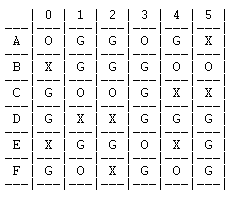
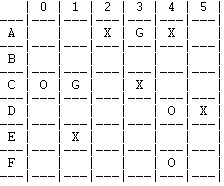
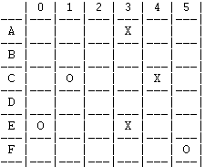

# PLOG 2020/2021 - TP1

## Group: T3_Greener3

| Name             | Number    | E-Mail                |
| ---------------- | --------- | --------------------- |
| António Bezerra    | 201806854 | up201806854@fe.up.pt  |
| Gonçalo Alves    | 201806451 | up201806451@fe.up.pt  |

## Greener

Greener is the second game of the Green-Greener-Greenest set. Green, Greener and Greenest are three games that use the same set of components.
Greener is a capturing game for 2 players, where both must capture the same colour.
Depending on the set, you’d have:

- Basic: a 6×6 board, 15 black pyramids, 20 green pyramids, 15 white pyramids.
- Advanced: a 6×9 – 9×9 board (using one or both pads), 30 black pyramids, 45 green pyramids, 30 white pyramids.

Gameplay overview:

- The board starts full of pyramids. Players take turns capturing pyramids or stacks of any colour orthogonally.
- The game ends when all players pass in succession. The player with the most green pyramids captured (being part of stacks they control) wins the game. In case of a tie, the player with the highest stack wins. If the tie persists, play again.

[Source](https://www.boardgamegeek.com/boardgame/227145/greengreenergreenest)
[Rules](https://nestorgames.com/rulebooks/GREENGREENERGREENEST_EN.pdf)


## Internal representation of the GameState

### Board

To represent the cells of the board we used lists within a list.
Since our game has a stacking feature, we decided to represent the stack as a list. This way, each cell is comprised of a list that contains all the pieces that are currently stacked within it.
Below is our implementation of said board:

```
    [
    [[white],[green],[green],[white],[green],[black]],
    [[black],[green],[green],[green],[white],[white]],
    [[green],[white],[white],[green],[black],[black]],
    [[green],[black],[black],[green],[green],[green]],
    [[black],[green],[green],[white],[black],[green]],
    [[green],[white],[black],[green],[white],[green]]
    ]
```

### Player

As for the players, we simply have a string representing each one.
Since each player has a colour assigned to them, when we are counting points or checking the taller stack and checking which player wins, there is no need to know if a stack belongs to a player, we simply get the piece at the top of a stack and check its colour.

### Gameplay

The rules of Greener state that: whichever Player holds the Black Pieces goes first; every turn, a player must make a capture or pass; the game ends when both players have passed their turn;

Having this in mind, our "game loop" is:

- Black player's turn, in which he played or passed;
- White player's turn, same situation as Black's;
- Verification of the GameState:
    - If at least one of the players didn't pass, continue the "game loop";
    - If both players passed their turns, end the game;
- In the case that the game has ended, each player's points are counted and the length of highest stack that each one possesses is retrivied:
    - If one of the players has scored more points than the other, said player wins;
    - If both players have the same points but one of the players has a higher stack, said player wins;
    - If none of these situation occur, the game is automatically replayed;

### GameStates

- Initial Situation:

```
   [
    [[white],[green],[green],[white],[green],[black]],
    [[black],[green],[green],[green],[white],[white]],
    [[green],[white],[white],[green],[black],[black]],
    [[green],[black],[black],[green],[green],[green]],
    [[black],[green],[green],[white],[black],[green]],
    [[green],[white],[black],[green],[white],[green]]
    ]
```
       | 0 | 1 | 2 | 3 | 4 | 5 |
    ---|---|---|---|---|---|---|
     A | O | G | G | O | G | X | 
    ---|---|---|---|---|---|---|
     B | X | G | G | G | O | O | 
    ---|---|---|---|---|---|---|
     C | G | O | O | G | X | X | 
    ---|---|---|---|---|---|---|
     D | G | X | X | G | G | G | 
    ---|---|---|---|---|---|---|
     E | X | G | G | O | X | G | 
    ---|---|---|---|---|---|---|
     F | G | O | X | G | O | G | 
    ---|---|---|---|---|---|---|


- Intermediate Situation:

```
    [  
    [[empty],[empty],[black],[green],[black],[empty]],  
    [[empty],[empty],[empty],[empty],[empty],[empty]],  
    [[white],[green],[empty],[black],[empty],[empty]],  
    [[empty],[empty],[empty],[empty],[white],[black]],  
    [[empty],[black],[empty],[empty],[empty],[empty]],  
    [[empty],[empty],[empty],[empty],[white],[empty]]  
    ]
```  
   
        | 1 | 2 | 3 | 4 | 5 | 6 |  
     ---|---|---|---|---|---|---|  
      A |   |   | X | G | X |   |  
     ---|---|---|---|---|---|---|  
      B |   |   |   | O | G | X |  
     ---|---|---|---|---|---|---|  
      C | O | G |   | X |   |   |  
     ---|---|---|---|---|---|---|  
      D |   |   |   |   | O | X |  
     ---|---|---|---|---|---|---|  
      E |   | X | O |   |   |   |  
     ---|---|---|---|---|---|---|  
      F | O |   |   |   | O |   |  
     ---|---|---|---|---|---|---|  


- Final Situation:

```
    [  
    [[empty],[empty],[empty],[black,white,green,green],[empty],[empty]],  
    [[empty],[empty],[empty],[empty],[empty],[empty]],  
    [[empty],[white,black,green],[empty],[empty],[black,green],[empty]],  
    [[empty],[empty],[empty],[empty],[empty],[empty]],  
    [[white,black,green,green],[empty],[empty],[black,green],[empty],[empty]],  
    [[empty],[empty],[empty],[empty],[empty],[white]]  
    ]
``` 

        | 1 | 2 | 3 | 4 | 5 | 6 |  
     ---|---|---|---|---|---|---|  
      A |   |   |   | X |   |   |  
     ---|---|---|---|---|---|---|  
      B |   |   |   |   |   |   |  
     ---|---|---|---|---|---|---|  
      C |   | O |   |   | X |   |  
     ---|---|---|---|---|---|---|  
      D |   |   |   |   |   |   |  
     ---|---|---|---|---|---|---|  
      E | O |   |   | X |   |   |  
     ---|---|---|---|---|---|---|  
      F |   |   |   |   |   | O |  
     ---|---|---|---|---|---|---|


## GameState Visualization

For a user friendly display, we replaced our values **black**, **white**, **green** and **empty** with symbols: **X**, **O**, **G** and **" "**, respectively. We achieved this by using a predicate called `symbol(Value,Symbol)` that does the said replacement. We also have a predicate `letter(Index,Letter)`, that replaces a number with a selected letter.
To print the board we used the predicates: `printBoard(Board)` - prints a line with the rows' indexes, for easier user selection and calls upon `printMatrix`; `printMatrix(List,Index)`- prints the letter associated with a line, calls `printLine` and recursively calls itself; `printLine(List)` - calls `printCell` and calls itself, recursively; `printCell(List)` - prints the **Head** of the list that represents the cell (displaying the full stack proved to be not very user friendly).

- Initial Situation:



- Intermediate Situation:



- Final Situation:



## Notes

To run the program:

- Run SICStus
- Choose -> src as Working Directory and Consult -> greener.pl
- Type -> play. in the console

For number input, type -> X. (X represents the number)
For letter input, type -> 'X'. (X represents the letter)
To check the diferent GameStates, please uncomment the lines in [initial(GameState)](src/play.pl) and [initialBoard/medBoard/finalBoard](src/display.pl) predicates.

### TO-DO:


- [ ]   Menu, for easier access and to choose size of board maybe;
- [ ]   Function to choose the AI's move, choose_move(+GameState, +Player, +Level, -Move);
- [ ]   Function canPlay will have to call valid_moves(+GameState, +Player, -ListOfMoves), therefore iterateMatrix will have to collect all valid moves
- [X]   Fix movement bug (currently moving in diagonals);
- [X]  Figure out how to store points (associate to Player, to Piece?...);
- [X]  Figure out how to store stack of pieces (if we want to store it in a piece; 
Head-Piece & Tail-Captured Pieces, must change display and replace functions);
- [X] Function to check if there is a possible capture (check every piece before turn and see if there is a value diferent than empty next to it ?);
- [X] Function to count points and, if necessary, count length of stack and decide who wins;
- [X] Fix replace empty bug, instead of replacing cell list with ['empty'] it's putting ['empty','black'];
