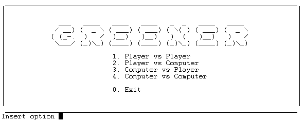
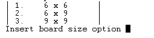
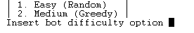
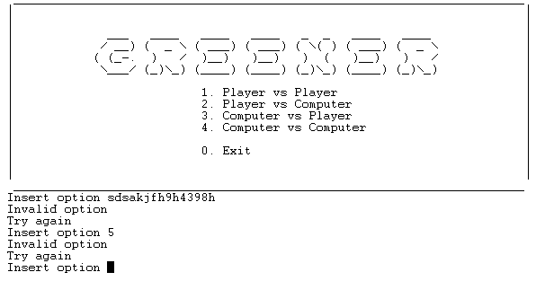
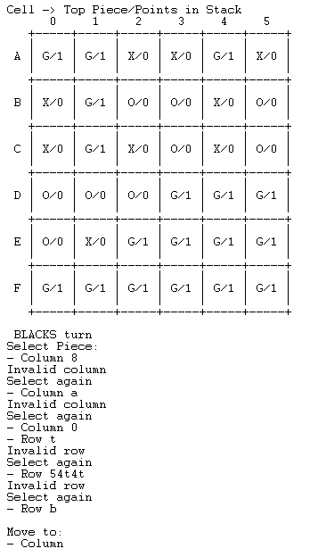
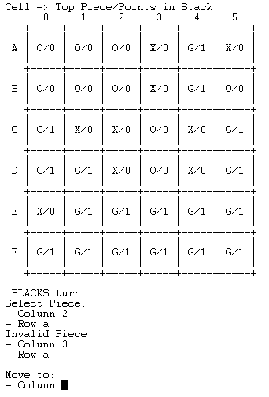
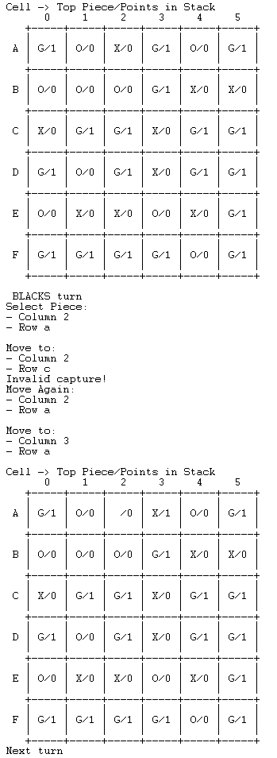

# PLOG 2020/2021 - TP1

## Group: T3_Greener3

| Name             | Number    | E-Mail                |
| ---------------- | --------- | --------------------- |
| António Bezerra    | 201806854 | up201806854@fe.up.pt  |
| Gonçalo Alves    | 201806451 | up201806451@fe.up.pt  |

## Instalation and Execution

To run our game follow the following steps:

- Install and run SICStus Prolog.
- Go to File > Working Directory and navigate to the *src* folder where you downloaded the code.
- Go to File > Consult and select the file *greener.pl*.
- **Alternatively:** run `consult('path\to\greener.pl').`
- Type `play.` into the SICStus console and the game will start.

## Greener

Greener is the second game of the Green-Greener-Greenest set. Green, Greener and Greenest are three games that use the same set of components, based on pyramid shaped pieces of three colors: white, black and green.

Greener is a capturing game for 2 players, where both must capture the green pieces on the board.

The game board can be configured in three different ways:

- Basic: a 6×6 board with 9 black pyramids, 18 green pyramids and 9 white pyramids.
- Intermediate: a 6x9 board with 18 black pyramids, 18 green pyramids and 18 white pyramids.
- Advanced: a 9×9 board with 27 black pyramids, 27 green pyramids and 27 white pyramids.

Gameplay overview:

- The board starts full with randomly placed pyramids.
- Players can move pieces of their color or stacks of pieces with a piece of their own color on top.
- The pieces or stacks can only be moved orthagonally and placed on top of another stack if there are no stacks in between.
- The player can capture a stack of any color.
- The player must capture a stack if possible. When no captures are possible the turn is **passed**.
- The game ends when both players pass their turn.
- The winner is the player that captures the most green pieces. In case of a tie, the player with the highest stack wins. If the tie persists, play again.

[Source](https://www.boardgamegeek.com/boardgame/227145/greengreenergreenest)

[Rules](https://nestorgames.com/rulebooks/GREENGREENERGREENEST_EN.pdf)

## Game Logic

### Game state representation

#### Board

To represent our board matrix we use a list of lists.

Since our cells will hold stacks of pieces, each cell is also a list, that will hold the pieces in it's stack, in top-down order.

Each piece is represented by a string that specifies the color: white, green or black. Empty cells are represented by a list that contains a single string: empty.

Below are examples of a board representation during the course of a game:

- Initial Situation:

```
    [
    [[black],[green],[black],[white],[green],[black]],
    [[black],[green],[green],[white],[white],[black]],
    [[green],[green],[black],[green],[black],[green]],
    [[black],[green],[white],[green],[black],[white]],
    [[green],[white],[white],[white],[white],[green]],
    [[green],[green],[green],[green],[green],[green]]
    ]
```

- Intermediate Situation:

```
    [
    [[black],[green],[black],[white],[green],[empty]],
    [[black],[black,green,green],[empty],[empty],[white],[empty]],
    [[green],[green],[empty],[empty],[empty],[empty]],
    [[black],[green],[white],[white,white,white,black,white,black,green,white,green,black,green,green,green,black,green,green],[empty],[empty]],
    [[green],[white],[empty],[empty],[empty],[empty]],
    [[green],[green],[green],[empty],[empty],[empty]]
    ]
```  

- Final Situation:

```
    [
    [[empty],[empty],[empty],[empty],[empty],[empty]],
    [[empty],[empty],[empty],[empty],[empty],[empty]],
    [[white,black,white,white,white,white,white,black,white,black,green,white,green,black,green,green,green,black,green,green,green,black,white,black,black,green,green,black,green,green,green,green,green,green,green,green],[empty],[empty],[empty],[empty],[empty]],
    [[empty],[empty],[empty],[empty],[empty],[empty]],
    [[empty],[empty],[empty],[empty],[empty],[empty]],
    [[empty],[empty],[empty],[empty],[empty],[empty]]
    ]
```

#### Player

As for the players, we simply have a string representing each one: BLACKS and WHITES.
To distinguish between a human and a computer player, we also use a flag string with the values H or C, respectively.

### GameState Visualization

#### Board

The board is displayed using the predicate `printBoard(GameState)` that calls other predicates: 
- `printHeader` - prints an indication of what the values in the cells mean.
- `printNumberHeader(0,NumCols)` - prints the label of the columns, starting from 0.
- `printDivider(0,NumCols)` - prints a separator line.
- `printMatrix(X, 0,NumRows,NumCols)` - prints the game board itself.

The `printMatrix` predicate in turn, calls other predicates:
- `letter(Index,Letter)` - translates a list index into a letter, for labeling each row, that is later printed.
- `printExtraLine(0,NumCols)` - prints a blank line with column separators, for a more appealing appearence.
- `printLine(Line)` - prints a row of cells.
- `printMatrix(Tail, N1,NumRows,NumCols)` - recursive call to print the following rows.

The `printLine` predicate calls `printCell` with the first element of the row list and recursively calls printLine to print all cells.

`printCell` calls `symbol(Value, Symbol)` to map the color of the piece on top of the stack (if any) to the symbols **X** (black), **O** (white), **G** (green). Empty cells have no symbol. Followed by the number of green pieces in the stack, obtained using `countPoints(+Cell, -Points)`.

Below are the visualizations for the game states showed in the [GameState Representation](#Board):

- Initial Situation:

```
      0     1     2     3     4     5
   +-----+-----+-----+-----+-----+-----+
   |     |     |     |     |     |     |     
 A | X/0 | G/1 | X/0 | O/0 | G/1 | X/0 | 
   |     |     |     |     |     |     |     
   +-----+-----+-----+-----+-----+-----+
   |     |     |     |     |     |     |     
 B | X/0 | G/1 | G/1 | O/0 | O/0 | X/0 | 
   |     |     |     |     |     |     |     
   +-----+-----+-----+-----+-----+-----+
   |     |     |     |     |     |     |     
 C | G/1 | G/1 | X/0 | G/1 | X/0 | G/1 | 
   |     |     |     |     |     |     |     
   +-----+-----+-----+-----+-----+-----+
   |     |     |     |     |     |     |     
 D | X/0 | G/1 | O/0 | G/1 | X/0 | O/0 | 
   |     |     |     |     |     |     |     
   +-----+-----+-----+-----+-----+-----+
   |     |     |     |     |     |     |     
 E | G/1 | O/0 | O/0 | O/0 | O/0 | G/1 | 
   |     |     |     |     |     |     |     
   +-----+-----+-----+-----+-----+-----+
   |     |     |     |     |     |     |     
 F | G/1 | G/1 | G/1 | G/1 | G/1 | G/1 | 
   |     |     |     |     |     |     |     
   +-----+-----+-----+-----+-----+-----+
```

- Intermediate Situation:

``` 
      0     1     2     3     4     5
   +-----+-----+-----+-----+-----+-----+
   |     |     |     |     |     |     |     
 A | X/0 | G/1 | X/0 | O/0 | G/1 |  /0 | 
   |     |     |     |     |     |     |     
   +-----+-----+-----+-----+-----+-----+
   |     |     |     |     |     |     |     
 B | X/0 | X/2 |  /0 |  /0 | O/0 |  /0 | 
   |     |     |     |     |     |     |     
   +-----+-----+-----+-----+-----+-----+
   |     |     |     |     |     |     |     
 C | G/1 | G/1 |  /0 |  /0 |  /0 |  /0 | 
   |     |     |     |     |     |     |     
   +-----+-----+-----+-----+-----+-----+
   |     |     |     |     |     |     |     
 D | X/0 | G/1 | O/0 | O/7 |  /0 |  /0 | 
   |     |     |     |     |     |     |     
   +-----+-----+-----+-----+-----+-----+
   |     |     |     |     |     |     |     
 E | G/1 | O/0 |  /0 |  /0 |  /0 |  /0 | 
   |     |     |     |     |     |     |     
   +-----+-----+-----+-----+-----+-----+
   |     |     |     |     |     |     |     
 F | G/1 | G/1 | G/1 |  /0 |  /0 |  /0 | 
   |     |     |     |     |     |     |     
   +-----+-----+-----+-----+-----+-----+
```

- Final Situation:

```
      0     1     2     3     4     5
   +-----+-----+-----+-----+-----+-----+
   |     |     |     |     |     |     |     
 A |  /0 |  /0 |  /0 |  /0 |  /0 |  /0 | 
   |     |     |     |     |     |     |     
   +-----+-----+-----+-----+-----+-----+
   |     |     |     |     |     |     |     
 B |  /0 |  /0 |  /0 |  /0 |  /0 |  /0 | 
   |     |     |     |     |     |     |     
   +-----+-----+-----+-----+-----+-----+
   |     |     |     |     |     |     |     
 C | O/18 |  /0 |  /0 |  /0 |  /0 |  /0 | 
   |     |     |     |     |     |     | 
   +-----+-----+-----+-----+-----+-----+
   |     |     |     |     |     |     |     
 D |  /0 |  /0 |  /0 |  /0 |  /0 |  /0 | 
   |     |     |     |     |     |     |     
   +-----+-----+-----+-----+-----+-----+
   |     |     |     |     |     |     |     
 E |  /0 |  /0 |  /0 |  /0 |  /0 |  /0 | 
   |     |     |     |     |     |     |     
   +-----+-----+-----+-----+-----+-----+
   |     |     |     |     |     |     |     
 F |  /0 |  /0 |  /0 |  /0 |  /0 |  /0 | 
   |     |     |     |     |     |     |     
   +-----+-----+-----+-----+-----+-----+
```

#### Menus

When a user runs the program, they are presented with the main menu, where they select the game mode they want to play:

- Player vs Player - two human players
- Player vs Computer - human plays first
- Computer vs Player - computer plays first
- Computer vs Computers - two computer players



After selecting a game mode, the user must select the board size to be used:



After that, when a computer is playing, the user must select the level of difficulty of the artificial inteligence:



#### Input validation

To prevent unexpected behavior upon invalid user inputs, we implemented robust user input validation that warns the user when the input was not valid and asks for a new try.

##### Menu input validation

In the case of menus, the input is invalid if it is out of the range of menu options or of a different type.

/ code /



##### Gameplay input validation

As for gameplay input validation, the validation checks not only if the selections are valid rows/columns in the board, but also if they represent a valid move according to the rules. For example, the black player may only select a black-topped stack and capture another stack without any stacks between them.

/ code /

- Invalid row/column - player inserts invalid/out of bounds values for row and column



- Invalid piece selection - player tries to select piece of a color diferent from his



- Invalid capture - player tries to capture unreachable stack



### List of valid moves

### Move execution

### End game state

### Board evaluation

### Computer move

## Conclusions

## Bibliography

## Deprecated

#### Gameplay

The rules of Greener state that: whichever Player holds the Black Pieces goes first; every turn, a player must make a capture or pass; the game ends when both players have passed their turn;

Having this in mind, our "game loop" is:

- Black player's turn, in which he played or passed;
- White player's turn, same situation as Black's;
- Verification of the GameState:
    - If at least one of the players didn't pass, continue the "game loop";
    - If both players passed their turns, end the game;
- In the case that the game has ended, each player's points are counted and the length of highest stack that each one possesses is retrivied:
    - If one of the players has scored more points than the other, said player wins;
    - If both players have the same points but one of the players has a higher stack, said player wins;
    - If none of these situation occur, the game is automatically replayed;

### TO-DO:

- [ ]   Function to choose the AI's move, choose_move(+GameState, +Player, +Level, -Move);
- [ ] Function to evaluate a move (maybe points or points and height)

- [X] CHANGE GAME LOOP: 1 player turn in this function, checks for game over after each turn;
- [X] CHANGE DISPLAY: show green pieces;
- [X]   Menu, for easier access and to choose size of board maybe;
- [X]   Function canPlay will have to call valid_moves(+GameState, +Player, -ListOfMoves), therefore iterateMatrix will have to collect all valid moves
- [X]   Fix movement bug (currently moving in diagonals);
- [X]  Figure out how to store points (associate to Player, to Piece?...);
- [X]  Figure out how to store stack of pieces (if we want to store it in a piece;
Head-Piece & Tail-Captured Pieces, must change display and replace functions);
- [X] Function to check if there is a possible capture (check every piece before turn and see if there is a value diferent than empty next to it ?);
- [X] Function to count points and, if necessary, count length of stack and decide who wins;
- [X] Fix replace empty bug, instead of replacing cell list with ['empty'] it's putting ['empty','black'];
